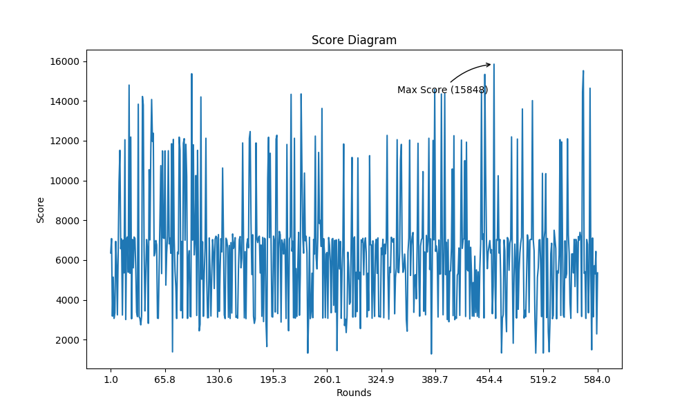
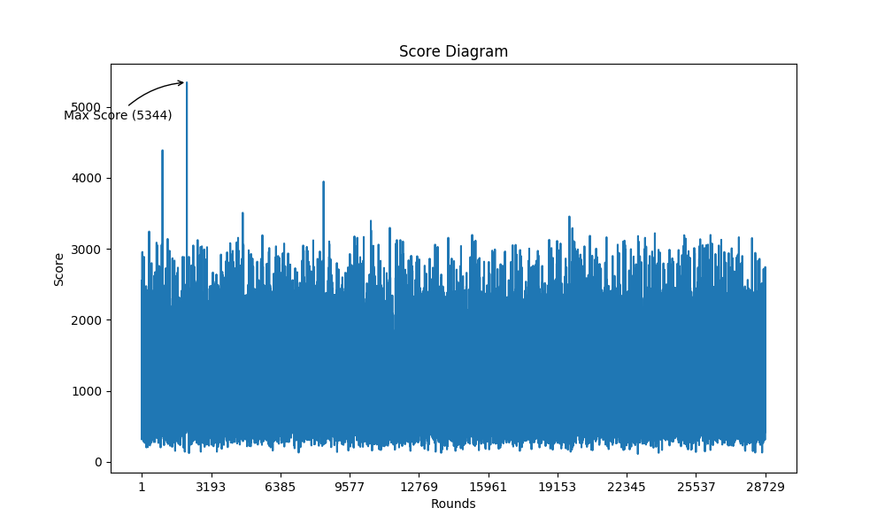

# Reinforcement Learning 2048

An AI BOT playing game 2048 by using reinforcement learning

## Overview

### Demo

### The Elements of 2048 Reinforcement Learning problem

- Objective: Get the highest score / max tile. i.e. Live as long as it can while maintaining good board state.

* State: An 4x4 grid with numbers of tiles in value of power of 2.
* Action: Shift board UP, DOWN, LEFT, RIGHT
* Reward: Increment of score or score with other metrics.

## Usage

Dependencies

* `tensorflow`
* `numpy`
* `pyyaml`

### Basic Game Play

```txt
$ python3 RL2048/Game/Play.py
Play mode:
1. Keyboard (use w, a, s, d, exit with ^C or ^D)
2. Random

 select:
```

* Keyboard mode
* Random mode

### Training model

```txt
$ python3 RL2048/Learning/backward.py
```

* TRAIN_MODE.NORMAL: Normal training process
    * Use only NN itself
* TRAIN_MODE.WITH_RANDOM
    * With a little chance to move randomly

### Statistics Report

```sh
$ python3 RL2048/Report/Statistics.py
```

* Success Rate of Tiles
* Scores Diagram
* Loss Diagram (TODO)

### Default file locations

* Model (ckpt): `./model`
* Last game status: `training_game.yaml`
* Training log: `training.log`
* Statistics report: `./report/StatisticsResult.md`

> If you have trouble that can't find RL2048 module. (`ModuleNotFoundError: No module named 'RL2048'`)
>
> You sould make sure your workspace is in the main directory of this project. Then execute code like this.

```sh
export PYTHONPATH=$PYTHONPATH:/path/to/this/project/ReinforcementLearning2048; python3 RL2048/Learning/backward.py
```

> Or add the following lines to every top of the codes.

```py
import sys
sys.path.append('/path/to/this/project/ReinforcementLearning2048')
```

## Policy Gradient

Heuristic: Artificial Intelligence: How many artifact, how many intelligence!

### Epsilon Decay

With a decaly probability that take control by "Teacher".

#### Random

#### Traditonal Tree-search algorithm

The [Monte Carlo tree search](https://en.wikipedia.org/wiki/Monte_Carlo_tree_search) algorithm

* Monotonicity
* Smoothness
* Free Tiles
* Z-shape

(Minimax search with alpha-beta pruning)

### Result of Policy Gradient

We found that Policy Gradient is not a good approach for 2048.

The main point is 2048 has a "local confort zone". That sometimes you need to take a negative action to move since the direction that you desired is invalid.

#### Problems

* Network is too stupid that it keep taking invalid aciton. = =
* Loss become too small and it seems that Network learned nothing in the first 100 round. -> Too small problem solved. But still learned nothing.

MCTS Policy Gradient



Random Policy Gradient



**idea**:

* Use Random build a history and use DQN to observe the pattern.
* Use MCTS build a experience history, then teach DQN how to play directly.

## Deep Q-Learning (DQN)

Improvement/Adjustment

1. Grid preprocessing
    * one-hot
2. Feed a batch of status-action pair
3. Loss function
4. Q-Learning gamma
5. Experience

## Notes

* [Reinforcement Learning Notes](https://github.com/daviddwlee84/DeepLearningPractice/blob/master/Notes/Technique/Reinforcement_Learning.md)
* There is a more elegant way to store a class object in yaml format by defining it as a subclass of yaml.YAMLObject. ([PyYAML Documentation](https://pyyaml.org/wiki/PyYAMLDocumentation) - `Constructors, representers, resolvers` section)

## Links

### Similar Project

Use Machine Learning

* [tjwei/2048-NN](https://github.com/tjwei/2048-NN) - Max tile 16384, 94% win rate
* [georgwiese/2048-rl](https://github.com/georgwiese/2048-rl)
    * [slides](https://docs.google.com/presentation/d/1I9RS3SMdMp8Uk9C6eyS6jK_w_34BKCrvkN-kWau1MU4/edit?usp=sharing)
* [nneonneo/2048-ai](https://github.com/nneonneo/2048-ai)
* [SergioIommi/DQN-2048](https://github.com/SergioIommi/DQN-2048) - with Keras
* [navjindervirdee/2048-deep-reinforcement-learning](https://github.com/navjindervirdee/2048-deep-reinforcement-learning) - Max tile 4096, 10% win rate

Use Traditional AI

* [daviddwlee84/2048-AI-BOT](https://github.com/daviddwlee84/2048-AI-BOT) - This was me and my friend Tom attending AI competition in 2014.
* [ovolve/2048-AI](https://github.com/ovolve/2048-AI) - 90% win rate
    * [demo](https://ovolve.github.io/2048-AI/)
* [jdleesmiller/twenty48](https://github.com/jdleesmiller/twenty48)
    * [Blog](https://jdlm.info/)
        * [The Mathematics of 2048: Counting States with Combinatorics](https://jdlm.info/articles/2017/09/17/counting-states-combinatorics-2048.html)
        * [The Mathematics of 2048: Counting States by Exhaustive Enumeration](https://jdlm.info/articles/2017/12/10/counting-states-enumeration-2048.html)
        * [The Mathematics of 2048: Optimal Play with Markov Decision Processes](https://jdlm.info/articles/2018/03/18/markov-decision-process-2048.html)
        * [The Mathematics of 2048: Minimum Moves to Win with Markov Chains](https://jdlm.info/articles/2017/08/05/markov-chain-2048.html)

Simple Game Play

* Python
   * [yangshun/2048-python](https://github.com/yangshun/2048-python)
   * [luliyucoordinate/Python2048](https://github.com/luliyucoordinate/Python2048)
* JavaScript
   * [gabrielecirulli/2048](https://github.com/gabrielecirulli/2048) - almost 10k stars
      * [demo](https://play2048.co/)
   * [GetMIT](https://mitchgu.github.io/GetMIT/)

### Article and Paper

* [Stackoverflow - What is the optimal algorithm for the game 2048?](https://stackoverflow.com/questions/22342854/what-is-the-optimal-algorithm-for-the-game-2048/)
* [MIT - Deep Reinforcement Learning for 2048](http://www.mit.edu/~amarj/files/2048.pdf)
* [Reddit - TDL, N-Tuple Network](https://www.reddit.com/r/2048/comments/2s6m8o/2048_ai_that_has_a_97_win_rate_tdl_ntuple_network/) - 97% win rate
    * [paper](http://www.cs.put.poznan.pl/mszubert/pub/szubert2014cig.pdf)
    * [demo](https://solver2048.appspot.com/#)
* [Stanford - AI Plays 2048](http://cs229.stanford.edu/proj2016/report/NieHouAn-AIPlays2048-report.pdf)

AlphaGo

* [DeepMind - AlphaGo Zero: Learning from scratch](https://deepmind.com/blog/alphago-zero-learning-scratch/)
* [AlphaGo Zero Explained In One Diagram](https://medium.com/applied-data-science/alphago-zero-explained-in-one-diagram-365f5abf67e0)
* [How to build your own AlphaZero AI using Python and Keras](https://medium.com/applied-data-science/how-to-build-your-own-alphazero-ai-using-python-and-keras-7f664945c188)

### Others

* [Key listener in Python](https://stackoverflow.com/questions/11918999/key-listeners-in-python)
